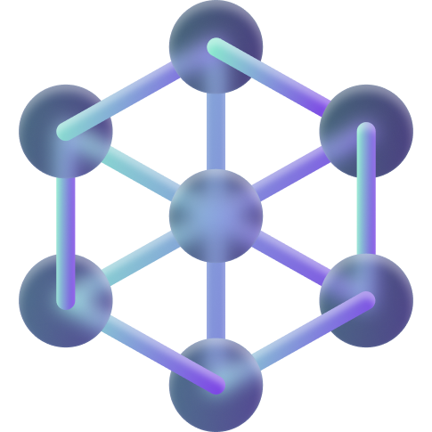

# EdCation3 - Descomplicando a Web3



## Introdução
EdCation3 é uma plataforma criada para alavancar as conexões no mundo profissional web3 e democratizar o acesso ao conhecimento em blockchain e criptoativos. Nela, usuários interessados em aprender sobre web3 recebem conteúdo gratuito e gamificado, ao passo que podem aprimorar sua experiência e entrar no banco de talentos profissionais da plataforma. Por outro lado, empresas e startups que necessitam de talentos qualificados de forma rápida e fácil podem acessar o banco de profissionais da plataforma e criar conexões de trabalho. Qualificando estudantes e aumentando a confiança e rapidez de contratações, planejamos auxiliar e criar novas oportunidades acadêmicas, profissionais e sociais através da Blockchain.

## Features
- Conteúdo educacional gratuito:
- Tracks educacionais técnicas:
- Gamificação:
- Banco de talentos:

## Instalação 
### Back-end e Blockchain
1. Pré-requisitos:
- Possuir o Docker e WSL2/uma distribuição linux instalados em seu computador

2. Instale o Rust
- ```curl --proto '=https' --tlsv1.2 -sSf https://sh.rustup.rs | sh```

3. Instale uma IDE (recomendamos utilizar o VSCode, o qual pode ser instalado no link abaixo)
- https://code.visualstudio.com/

4. Instale o Foundry
- ```curl -L https://foundry.paradigm.xyz | bash```

5. Instale e ative o Nitro devnode
- ```git clone https://github.com/OffchainLabs/nitro-devnode.git```
- ```cd nitro-devnode```
- ```./run-dev-node.sh```

6. Instale o cargo stylus
- ```cargo install --force cargo-stylus```

7. Adicione o WASM
- ```rustup default 1.80```
- ```rustup target add wasm32-unknown-unknown --toolchain 1.80```

### Front-end

## Estrutura de pastas

```
HACKATHON-BH
├── certificado-nft
│   └── ...
├── token-smd
|   └── ...
├── client
│   └── ...
├── README.MD
│   
```

- certificado-nft
    - pasta com o projeto certificado como nft emitido na Arbitrum com Arbitrum Stylus
- token-smd
    - pasta com o projeto token simulador (SMD) como erc-20 emitido na Arbitrum com Arbitrum Stylus

## Tech Stacks

### Backend & Blockchain
##### API:
- 

##### Pacotes externos
- rustup
- rustc
- cargo

##### Framework de arquitetura de software
- a

### Front-end

##### Pacotes externos
- a

## Roadmap
- Futuras funcionalidades

## Agradecimentos
Um agradecimento especial à equipes de organização do Modular Carnival e a Arbitrum pela oportunidade. 
